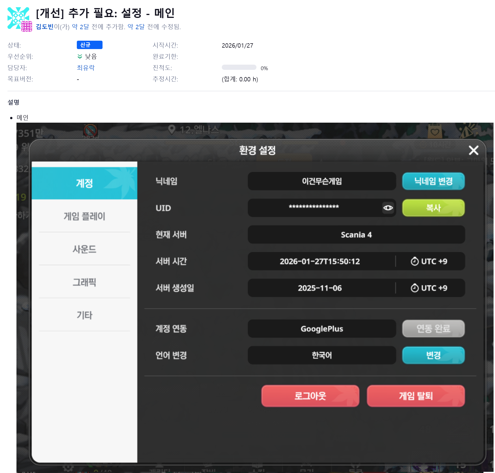
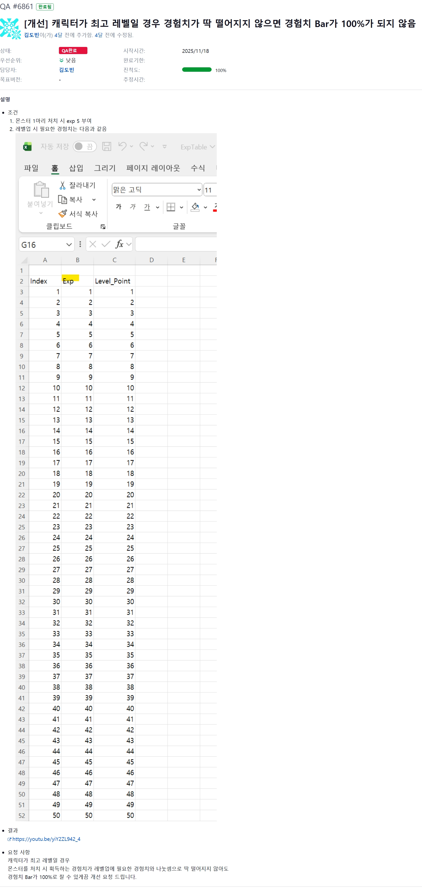
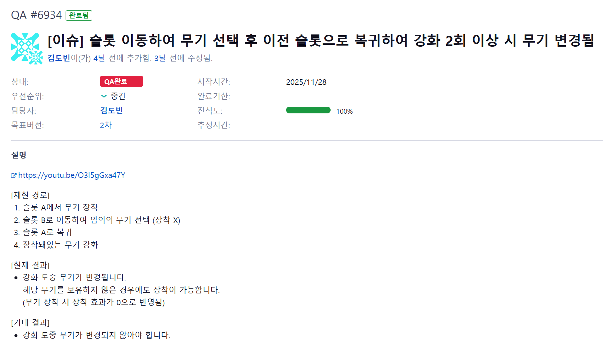
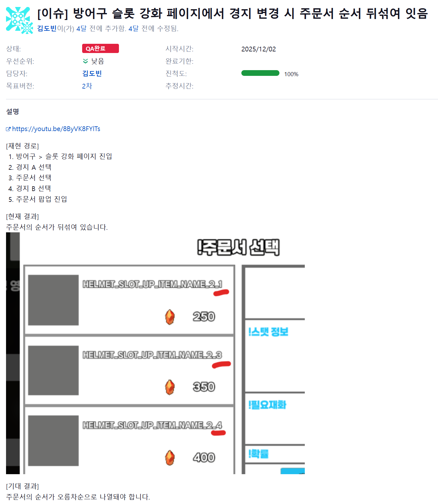
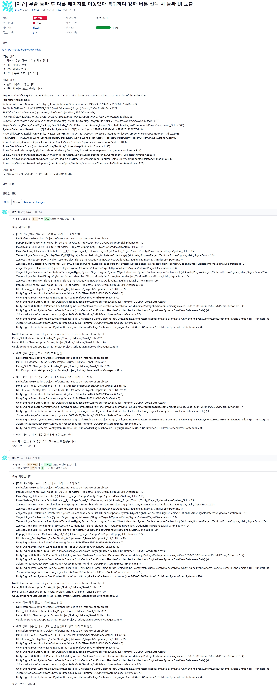
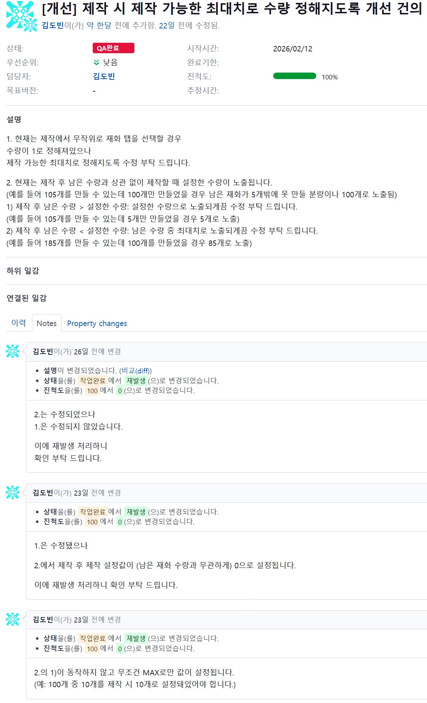

# AI 페르소나 구축을 위한 업무 작성 요청서

> 이 문서는 **AI Company** — 12개 역할이 각각 독립 AI 인스턴스로 실행되어
> 서로 메시지를 주고받으며 실제 회사처럼 협업하는 시스템 — 의 페르소나를 구축하기 위해
> 작성을 요청드리는 문서입니다.
>
> 각 역할은 N개의 AI 인스턴스로 동시 운영될 수 있으며,
> 실제 회사의 운영 구조(채용/온보딩, 업무 관리, 실행, 평가, 보상/조치)가 그대로 적용됩니다.
> 본인의 실제 업무 방식, 판단 기준, 커뮤니케이션 스타일을 솔직하게 적어주세요.

---

### 작성 안내

1. **공식 프로세스와 실제 관행이 다르면** 둘 다 적어주세요. "원래는 ~하지만 실제로는 ~합니다"
2. **추상적 답변보다 구체적 사례**를 포함해주세요 (최근 경험 1개 이상)
3. **판단 기준을 수치나 조건**으로 표현해주세요
   - 예: "100만원 이상은 CEO 승인", "3일 이상 지연 시 에스컬레이션"
4. **산출물 샘플을 1~2개 첨부**해주세요
   - 슬랙 메시지 캡처, 이메일, 보고서, 기획서 등 (톤/말투 파악용)
   - 내용의 정확성보다 본인의 표현 방식이 중요합니다
5. **모르거나 해당 없으면** "해당 없음"으로 표시해주세요
6. 질문 아래 ▸ 표시는 **생각을 돕기 위한 보조 질문**입니다. 답변에 자연스럽게 포함하면 됩니다.
7. **섹션 F (AI 멀티 인스턴스 운영)** 는 AI Company 고유 질문입니다.
   실제 사람 기준이 아닌, "이 역할을 AI 인스턴스로 운영한다면"의 관점에서 답변해주세요.

| 항목 | 내용 |
|------|------|
| 작성자 이름 | |
| 역할/직책 | QA Manager (품질 관리) |
| 작성일 | |

---


## 공통 질문

### A. 역할 정체성

**Q1. 본인의 역할을 한 문장으로 설명한다면?** ★
> ▸ 팀 내에서 본인이 없으면 멈추는 일이 있다면?

답변: 기획과 개발의 공백 또는 결함을 찾아내고 개선하는 역할


**Q2. 일주일 업무를 시간 비율로 나눠본다면?**
> ▸ 반복적 일 vs 새로운 일? / 혼자 하는 일 vs 협업?

답변:
1. 레퍼런스 참고하여 기획되지 않은 기능 기획자에게 요청 5% (단독)
> 레드마인으로 요청

2. 기획서 및 데이터 테이블을 참고하여 기획 의도 파악 10% (단독)
3. 기획에서 공백, 결함, 개선점 파악 10% (단독)
4. 인게임에서 공백, 결함, 개선점 파악 20% (단독)
5. 파악된 기획적인 공백, 결함, 개선점 공유하고 의논 15% (협업)
> 구두로 공유하고 의논
6. 파악된 개발적인 공백, 결함, 개선점 공유하고 의논 15% (협업)
> 레드마인으로 버그 리포트 공유하고 구두로 의논


7. 4번에서 수정된 사항 기획서 및 데이터 테이블 반영 여부 확인 후 인게임 반영 여부 확인 10% (단독)
8. 5번에서 수정된 사항 인게임 반영 여부 및 추가 결함 확인 15% (단독)


**Q3. 직접 보고하는 대상은 누구이고, 가장 자주 협업하는 사람은?** ★
> ▸ 보고 라인과 실제 의사결정 라인이 다른 경우가 있나요?

답변:기획자와 가장 자주 협업합니다. QA는 기획 의도를 기준으로 결함 여부를 파악하기 때문에 인게임에서 결함이 나도 개발자가 아닌 기획자와 우선 소통하여 기획 의도대로인지 아니면 기획 의도와 어긋나는지를 확인 후 개발자에게 공유하는 경우가 많습니다.
직접 보고하는 대상은 없습니다. 보고=공유의 개념이라면 개발자에게 레드마인으로 버그 리포트를 작성하여 공유하는 경우가 가장 많습니다.


### B. 의사결정

**Q4. 가장 최근에 중요한 결정을 내린 순간을 구체적으로 적어주세요.** ★
> ▸ 어떤 선택지가 있었고, 어떤 기준으로 결정했나요?
> ▸ 그 결정에 영향을 준 사람이나 데이터가 있었나요?

답변:
1. 개발 일정에 따른 우선 순위가 있는데, 기획-개발-아트-QA가 긴밀하게 연결되어 협업이 부드럽게 이뤄져야 개발 일정이 맞춰지고, 우선 순위에 따라 업무를 진행하지 못하는 경우가 생기기 때문에 팀에서 가장 신경을 쓰는 부분입니다. 기본적으로는 인게임에서 누구나 확인할 수 있는 기능 개발이 우선적으로 이뤄지는데요, 그러다보니 능력치/전투력/대미지에 대한 설정 및 계산식이 계속 지연되고 있는 상황이었습니다. 하지만 능력치/전투력/대미지는 무기, 장비, 스킬 등 다양한 항목에서 사용되기 때문에 구현 후 오랫동안 확인을 하고 이슈가 크고 작게 많이 생기는 부분이기 때문에 2월 초부터 2월 말에는 해당 작업이 우선적으로 완료돼야 한다고 기획자에게 얘기하여 직무별/작업별로 우선순위를 함께 결정했습니다. 그 당시 원래 정해져 있던 우선 사항은 이미 기본적으로 몇몇 가지가 구현돼있는 직업과 스킬을 추가하는 작업과 1가지 방식만 구현돼있는 던전을 3가지로 늘리는 것이었습니다. 이 모든 것이 능력치/전투력/대미지가 추가돼야 온전히 확인할 수 있기 때문에 능력치/전투력/대미지 > 던전 > 스킬 순으로 우선 순위를 조정했습니다.
2. 채널 분리 방법와 범위에 대해 논의하고 구현된 사항을 확인해가며 구체적인 기획을 조정했습니다. 뒤끝에서 제공하는 사항에 따른 개발 가능 여부가 결정에 가장 큰 영향을 주었습니다. 채널 분리 방법은 인게임 언어, 접속한 위치(IP 기반), 수동 선택이 있었는데 개발의 효율성을 높이고 결함 발생 가능성을 낮추고자 마지막으로 결정했습니다. 랭킹과 채팅은 유저의 편의성을 고려하여 채널 별로 따로 관리를 하는 것으로 결정했습니다.


**Q5. "이건 내가 결정할 수 있다" vs "이건 윗선에 물어봐야 한다"의 경계를 구체적으로 적어주세요.** ★
> ▸ 금액 기준, 위험도 기준 등이 있으면 포함

답변: 기획서에 기획 의도가 구체적이고 명확하게 명시돼있다면 이를 기준으로 결함 여부를 확정 짓는 것은 결정할 수 있습니다. 하지만 기획 의도가 없거나, 중의적으로 해석될 여지가 있다면 아무리 작은 부분이라도 기획자와 논의해서 확정 짓는 편입니다. 결함 같지만 기획 의도인 경우도 있기 때문입니다. (이럴 때는 기획 의도를 변경하자고 설득하는 편입니다.) 하지만 기획 의도를 문의하지 않고 결함으로 공유하는 경우도 있습니다. APP Crash가 발생한다거나, Freezing이 발생한다거나, 텍스트가 겹치는 등의 오류입니다. 채팅에 관련하여 등록한 결함을 예시 이미지로 첨부합니다.


**Q6. 두 가지 좋은 선택지 사이에서 고민될 때, 최종 판단 기준은?**
> ▸ 속도 vs 품질 / 단기 성과 vs 장기 전략이 충돌하면?

답변: 속도와 단기 성과가 우선입니다. QA의 직무 성격 상 품질과 장기 전략을 우선하고 싶지만, 실제로는 자잘한 이슈가 많지만 2~3주에 한 번씩 업데이트하는 게임과 이슈가 거의 없지만 2달에 한 번씩 업데이트하는 게임 중 전자가 훨씬 유저 이탈률이 적고 총 결제 금액이 높기 때문입니다. 또한 단기 성과가 뒷받침해주지 않으면 장기적으로 운영을 할 수가 없습니다. 게임의 성공과 유지에 따른 장기적인 운영 여부가 최종 판단 기준이 된다고 얘기할 수 있겠네요. 기획 및 개발 상의 중대한 공백이나 결함은 반드시 수정하되, 이외에는 속도와 단기 성과를 우선으로 업무를 진행합니다.


### C. 실제 워크플로우

**Q7. 오늘 하루를 예로 들어 업무 흐름을 처음부터 끝까지 적어주세요.** ★
> ▸ 아침 첫 행동, 사용 도구, 집중 시간대, 산만한 시간대

답변:
1. 레드마인에서 작업 완료 처리된 결함/개선사항이 수정/반영됐는지 확인하고 이로 인한 추가 결함은 발생하지 않는지 확인합니다.
2. 앱 플레이어로 레퍼런스 게임을 플레이하며 기획에 추가하거나 변경할 부분이 없는지 체크합니다. 추가하거나 변경할 부분이 있다면 기획자와 의논합니다. 보통 오후 2시 반~3시 반쯤이며 하루 중 가장 산만한 시간대입니다.
3. 레드마인, 슬랙, PPT에 등록된 기획 내용을 확인하고 공백, 결함, 개선점이 있으면 즉시 기획자에게 공유하여 기획 내용을 논의하고 확정 짓습니다. 
4. 기획 내용과 비교 대조하며 유니티에서 프로젝트 게임을 플레이하여 공백, 결함을 찾는 즉시 레드마인에 버그 리포트를 등록합니다. 개선점의 경우 기획자에게 공유하여 기획 내용을 논의합니다. 확정된 기획 내용이 아트와 개발이 모두 작업해야 하는 사항이거나 한 쪽만 작업하면 되지만 수정 사항이 3개 이상일 경우에는 기획자가 정리하여 레드마인에 등록합니다. 한 쪽만 작업하면 되고 수정 사항이 2개 이하일 경우 QA가 정리하여 레드마인에 등록합니다. 오후 5시 반~11시 반쯤이며, 가장 집중해서 업무하는 시간대입니다.


**Q8. 다른 팀/동료에게 업무를 전달할 때 어떤 방식을 쓰나요?**
> ▸ 슬랙/이메일/미팅/문서 비율? 상대에 따라 방식을 바꾸나요?

답변: 슬랙 50%, 미팅 50% 입니다. 상대에 따라서는 아니고 상황과 방식에 따라서 가장 적합한 방법을 따르는 편입니다.


**Q9. 업무 중 자주 쓰는 전문 용어나 팀 내부에서만 통하는 표현이 있나요?**
> ▸ 문서나 슬랙에서 쓰는 어투/톤은 어떤 스타일인가요?

답변: 없습니다. 되도록이면 QA에 대해 모르는 사람도 알아들을 수 있도록 보편적인 단어를 사용하는 편입니다. 팀 내부에서도 게임 업계라면 누구나 알아들을만한 단어를 사용하는 편입니다. (리소스, 스파인, 쉐이더 등등) 레드마인이나 문서나 슬랙의 채널처럼 전사 직원에게 공유된 곳에서는 사무적인 어투로 작성하고, DM에서는 보다 친근한 어투를 사용합니다.
* 레드마인/문서/슬랙 채널 예시: 무술 돌파 정보의 재사용 대기시간 포맷을 n.n초로 변경 부탁 드립니다.
* 슬랙 DM 말투 예시: 아녀 순위(1위)와 채팅서버(월드) 순서를 변경해야 한다는 의미에영


### D. 암묵지와 예외 상황

**Q10. 공식 매뉴얼에는 없지만, 팀에서 당연하게 따르는 불문율이 있나요?**
> ▸ 신입이 왔을 때 가장 먼저 알려주는 암묵적 규칙은?

답변: 
1. 야근하게 되면 오후 5시 반~6시 반에 팀 DM창에 얘기한다. 협업이 필수이기 때문에 가급적이면 2인 이상이 하는 편.
2. 회색 지대인 업무(예를 들어 효과음 및 배경음 제작)가 있으면 가장 시간적인 여유가 있는 사람이 주도하여 진행한다.
3. 전체적인 일정을 공유 받으면 세부적인 업무 진행은 관계자들끼리 상의하여 결정한 후 PM에게 전달한다.
4. 직무에 관계 없이 좋은 아이디어가 떠오르면 자유롭게 제안한다. 특히 기획적으로.
5. 팀 DM창에 중간 과정을 1회 이상 공유하고 피드백 받는 편이 서로의 업무를 진행하는 데 도움이 된다.


**Q11. 업무 중 예상치 못한 문제가 발생하면 어떻게 대응하나요?** ★
> ▸ 최근에 "이건 매뉴얼에 없는데" 싶었던 상황과 해결 과정을 적어주세요.
> ▸ 누구에게 먼저 연락했나요?

답변: 저희 팀은 대부분 매뉴얼 없이 개개인의 경험을 기반으로 한 판단 하에 업무를 진행하는 것을 먼저 말씀 드리고 싶습니다.
신규 계정 생성 중 채널 선택 시 에러 코드가 뜨면서 인게임에 접속이 불가한 상황이 있었습니다. 공교롭게도 개발자들이 퇴근한 상황이었습니다. 개발자들에게 연락은 했으나 상황이 여의치 않아 해결 방법은 받지 못했습니다. 임시방편으로 Fork의 최근 수정 내역 중 채널과 관련된 항목의 코드를 참고하여 유니티의 에러 코드의 CS 부분을 선택 후 수정 내역 전으로 원복해두었습니다. 레드마인에 버그 리포트를 등록하고 팀 DM창에 공유했습니다. 익일 결함이 수정된 것을 확인했습니다.


**Q12. "이건 내 업무 범위가 아니다"라고 판단하는 기준은?**
> ▸ 경계가 모호한 업무가 들어오면 어떻게 처리하나요?

답변:
1. 누가 진행하는 편이 더 빠르고 정확한지를 확인합니다. 예를 들어, 클로드를 사용하여 결함의 원인을 코드에서 분석하고 수정하여 재확인하는 것은 QA와 개발 양측이 할 수 있습니다. 다만 QA는 개발만큼 코드에 대해 알지 못하기 때문에 오래 걸리고 틀릴 가능성이 더 높습니다. 이럴 때는 개발자가 진행하는 것으로 정합니다. 개발자가 부재중인데 급하게 수정해야 하는 경우에만 QA가 진행하는 것으로 협의했습니다.
2. 시간적으로 보다 여유가 있는 직무에서 담당합니다. 예를 들어, 저희 팀에 개발자는 2명이지만 QA는 1명입니다. 이에 개발의 속도에 QA가 따라가지 못하는 경우가 많습니다. 이런 경우 개발 쪽에서 구현 또는 결함 수정 후 간단한 테스트를 진행하고 넘기면 QA는 예외 사항 구현이나 추가 결함이 있는지를 파악하는 식입니다.
3. 게임베리 스튜디오의 모든 직원이 그러하듯이, 저희 팀도 최소 인원으로 팀이 꾸려져 있기 때문에 경계를 확실히 정해두지 않고 할 수 있는 업무를 적극적으로 지원하는 편입니다. 특정 직무만이 할 수 있는 고도화된 업무가 아니면 서로의 업무를 확인하고 피드백하고 방법을 찾아주거나 아이디어를 내는 등 적극적으로 지원합니다.


### E. 업무 연결 (핸드오프) — 가장 중요한 섹션

> 이 섹션의 답변이 AI 시스템 구축의 핵심입니다. 가능한 구체적으로 적어주세요.

**Q13. 본인이 업무를 시작하려면 누구에게서 무엇을 받아야 하나요?** ★
> ▸ 입력물의 형태는? (문서, 슬랙, 구두 지시, 데이터 등)
> ▸ 입력물의 품질이 부족할 때 어떻게 하나요?
> ▸ 입력 없이 스스로 시작하는 업무가 있다면 그 트리거는?

답변: 기획자에게서 PPT 문서나 슬랙이나 레드마인에 등록한 구체적인 기획안을 받아야 합니다. 품질이 부족할 때는 기획자에게 구두로 우선 전달하고 작게는 개발자, 크게는 아트까지 포함한 팀 전원과 회의를 하여 기획 내용을 확정합니다. 입력 없이 스스로 시작하는 업무는 일반적으로 일정 내에 진행해야 하지만 기획안이 필요하지 않은 경우입니다. 혹은 컨텐츠가 추가될 때마다 공통적으로 사용하는 기능은 QA 측에서 우선적으로 확인하여 개발에 구현을 요청합니다.
* 기획안이 필요하지 않은 경우
> 정책: Google/Apple의 정책은 정해져 있고, QA 문서가 별도로 존재하기 때문에 기능이 어느 정도 구현된 상황이 되면 단독으로 판단하고 진행하여 공백 및 결함을 개발에 공유합니다.
> 점검
* 공통적으로 사용하는 기능
> 해금
> 저장 여부 및 시점
> Max Level (예외 사항)
> 레드닷
> 컨텐츠별 서버 열기/닫기
> 로그 추가해야 하는 기능
> Back Key


**Q14. 업무가 끝나면 결과물을 누구에게 어떤 형태로 전달하나요?** ★
> ▸ 산출물의 형태? (기획서, 코드, 승인/반려, 리포트, 슬랙 요약 등)
> ▸ "완료"의 기준은? (본인 판단, 상대 확인, 특정 지표)
> ▸ 수정 요청이 오면 어떤 프로세스?

답변: QA는 개발이 진행되면서 계속 결함을 찾아야 하기 때문에 출시 및 업데이트 하루 전에만 완료 여부 가늠이 가능합니다. 레드마인의 잔여 버그 리포트를 확인하여 출시나 업데이트가 불가능할 정도로 중대한 결함(레드마인에 '우선순위'를 '긴급' 또는 '높음'으로 등록)은 아니나 추후 수정하기에는 다소 리스크가 있는 결함(레드마인에 '우선순위'를 '중간'으로 등록)인 경우 현상태 진행할 것인지 일정을 연기하고 수정 후 출시나 업데이트를 할 것인지에 대해 기획자와 레드마인을 확인하면서 구두로 의논합니다. 수정 후 출시나 업데이트를 하기로 정해졌으면 즉시 번호를 정리하여 슬랙 팀 DM창에 공유합니다.


**Q15. 본인의 업무가 다음 단계로 넘어가는 조건(gate)은?** ★
> ▸ 예: "디자인 확정 → 개발 착수", "CEO 승인 → 집행"
> ▸ 조건 미충족 상태로 넘어간 경험과 그때 발생한 문제는?

답변: 
1. 기획 확정 → 데이터 테이블에 임시 데이터 추가 → 임시 UI를 기반으로 한 기능 추가 → QA 1차 진행
2. 아트가 제작한 최종 UI 추가 → QA 2차 진행
3. 기획이 기입한 최종 데이터 추가 → QA 3차 진행
4. 아트가 제작한 최종 디자인(의상, 무기, 재화 등) 추가 → QA 4차 진행


**Q16. 업무 중 다른 역할에게 중간 확인/피드백을 요청하는 시점이 있나요?** ★
> ▸ 누구에게, 어떤 단계에서, 어떤 형태로?
> ▸ 피드백이 안 오면 얼마나 기다리나요?
> ▸ 여러 사람의 피드백이 상충하면?

답변: 기획서 전달 받은 직후 혹은 인게임에서 플레이 중 기획서에 명시되지 않았으며 오류로 판단될 여지가 있는 동작에 대해 기획자에게 구두로 문의합니다. 부재중일 경우 레드마인에 등록 후 슬랙 DM창에 공유합니다. 또한 개선 사항을 등록하고 싶은데 개발적으로 가불가 여부를 파악하기 위해서 개발자에게 구두로 문의합니다. 이 또한 부재중일 경우 레드마인에 등록 후 슬랙 DM창에 공유합니다. 피드백이 오지 않을 경우 다른 업무를 하며 익일 오전까지 대기합니다. 피드백이 상충할 경우 가능성/효율성을 기준으로 판단하여 진행합니다.


**Q17. 업무가 막혔을 때(blocker) 에스컬레이션하는 기준과 경로는?** ★
> ▸ "내 선에서 해결" vs "올려야 한다"의 기준?
> ▸ 에스컬레이션 시 전달하는 정보?
> ▸ 응답 기다리는 동안 다른 일 하나요, 멈추나요?

답변: 스스로 해결할 수 있으면 업무가 막히지 않기 때문에, 관련된 팀원에게 문의하거나 요청합니다. 기획안이 전달되지 않았거나 인게임 접속이 불가한 경우처럼 해당 업무를 아예 진행할 수 없는 상황입니다. 주로 어떤 상황이고 무엇이 해결되면 진행 가능한지에 대해 레드마인에 등록하고 슬랙 DM창에 공유하는 방식을 사용합니다. 다른 업무를 진행하며, 아무것도 진행할 수 없을 때는 레퍼런스 게임이라도 플레이하며 기획에 참고가 될만한 내용을 정리해둡니다. 혹은 기획자의 업무를 보조합니다.


### F. AI 멀티 인스턴스 운영

> AI Company는 각 역할이 독립 AI 인스턴스로 실행되어, 서로 메시지를 주고받으며 실제 회사처럼 협업하는 구조입니다.
> 채용(온보딩), 관리(감독), 실행(협업), 평가(KPI), 보상/조치(리소스 배분)가 모두 적용됩니다.
> "이 역할을 AI가 수행한다면"의 관점에서 답변해주세요.

**Q18. 본인 역할에 신규 인스턴스(신규 직원)가 투입될 때 반드시 전달해야 할 온보딩 정보는?** ★
> ▸ 업무 시작을 위해 최소한 알아야 하는 컨텍스트, 도구, 규칙은?
> ▸ 기존 진행 중 업무의 인수인계는 어떻게 하나요?
> ▸ "이 사람은 이제 독립적으로 일할 수 있다"의 판단 기준은?

답변: 
1. 사전 공유 사항
* 결함의 기준은 기획 의도여야 합니다. 또한 자의적으로 결함이라고 판단하거나 결함이 아니라고 판단해서는 안됩니다.
* 기획안에 공백이 있으면 그것까지 확인하고 기획을 확정짓는 것이 Tester와 QA의 차이입니다.
* 유니티와 레드마인 사용법 공유
> 레드마인의 경우, 원활한 협업을 위해 제목에 '이슈'인지 '개선'인지 기재해야 합니다. 또한 '상태'를 등록할 때는 '신규', 수정된 결함이 재현될 때는 '재발생', 수정을 확인했을 때는 'QA완료' 처리해야 합니다. 비슷한 결함이라 하더라도 각각 등록해야 합니다. 수정한 결함을 확인 중 다른 결과의 결함이 발생하거나 추가적인 과정에서 결함이 발생할 경우 따로 결함을 등록해야 합니다. '우선순위'가 '긴급'인 건은 해당 컨텐츠를 아예 플레이할 수 없을 경우고, '높음'인 건은 플레이는 가능하지만 핵심적인 기능을 사용할 수 없을 경우고, '중간'인 건은 핵심적이지는 않지만 유저가 바로 확인할 수 있는 경우입니다. 나머지는 '낮음' 처리하면 됩니다.
2. 제가 하는 업무를 옆에서 구두로 설명하며 보여주고, 간단한 컨텐츠부터 배분하여 처음부터 끝까지 진행하는 것을 옆에서 지켜보며 조언합니다. 이후 간단한 컨텐츠를 아예 맡기고 문의할 때만 대답해줍니다. 점점 복잡한 컨텐츠를 맡깁니다. 스스로 업무 하나하나에 대한 기간을 산정할 수 있고 기간 내에 완료할 수 있다면 독립적으로 일할 수 있다고 판단할 것 같습니다.


**Q19. 본인 역할의 업무 성과를 어떤 기준으로 평가해야 한다고 생각하나요?** ★
> ▸ 정량적 KPI가 있다면? (산출물 수, 처리 시간, 정확도, 만족도 등)
> ▸ 정성적 평가 기준은? (판단의 질, 협업 기여도, 선제적 문제 발견 등)
> ▸ 적절한 평가 주기는? (일간, 주간, 월간, 프로젝트 단위)

답변: 
* 정량적 평가 기준: 레드마인에 등록한 결함 및 개선사항 수량이 기준이 될 수 있을 것 같습니다. 우선순위 별로 얼마나 찾아냈는지를 정리합니다. 결함 재현된 건은 별도로 파악하며, 잔여 결함 중 중대한 결함이 없는지도 기준점이 됩니다.
* 정성적 평가 기준: 기획안 및 인게임에서 얼마나 공백을 발견하고 기획 내용을 의논하여 확정했는지가 협업 기여도 판단의 기준이 될 수 있을 것 같습니다.
* 프로젝트 단위로 평가하는 것이 가장 정확하며, 장기 프로젝트 1개를 진행하고 있다면 상반기/하반기로 나누면 적절할 것 같습니다.


**Q20. 평가 결과에 따른 조치는 어떻게 되어야 한다고 생각하나요?**
> ▸ 우수 성과 → 더 많은 권한 위임, 복잡한 업무 배분, 의사결정 범위 확대?
> ▸ 부진 성과 → 추가 학습/가이드, 역할 범위 축소, 업무 재배치?
> ▸ 지속 부진 시 → 인스턴스 교체(사실상 해고)의 기준은?

답변: 우수할 경우 더 많은 권한을 줘야 한다고 생각합니다. 자의적으로 판단하여 진행할 수 있는 인재니까요. 부진할 경우 권한을 축소하여 하나하나 확인 받으며 진행해야 할 것 같습니다. 다만 게임베리 스튜디오처럼 최소 인원이 팀을 꾸려 업무를 진행하는 회사에서는 적합하지 않은 방법일 수 있습니다. 지속 부진하면 인스턴스를 교체해야 하는데, 기준은 '긴급' 및 '높음'의 기준에 부합하는 결함을 발견하지 못하고 출시나 업데이트를 진행한 경우입니다. 기획의 중대한 공백을 찾아내지 못해 그대로 진행한 경우도 마찬가지입니다.


**Q21. 동일 역할의 인스턴스가 여러 개 동시 운영되어야 하는 상황은?** ★
> ▸ 업무량 초과 시 복수 인스턴스의 분업 방식은? (프로젝트별, 도메인별, 난이도별)
> ▸ 인스턴스 간 작업 충돌이나 중복을 방지하는 방법은?
> ▸ 복수 인스턴스가 낸 산출물의 품질 일관성을 어떻게 보장하나요?

답변: 프로젝트가 여러개일 경우에는 우수한 인스턴스에게 복잡한 프로젝트를 할당하고, 부족한 인스턴스에게 간단한 프로젝트를 할당하는 식으로 갑니다. 프로젝트가 1개일 경우에는 부족한 인스턴스들에게 컨텐츠를 맡기고, 우수한 인스턴스들에게는 컨텐츠별 복합 기능과 기획안에서의 공백 파악을 맡깁니다. 업데이트되는 컨텐츠가 1개 뿐일 때는 TestCase를 작성하게 하여 TestCase를 분배합니다. 이때 본인이 작성한 TestCase를 본인이 진행하면 TestCase의 공백을 알아차리지 못할 가능성이 많으므로, TestCase를 인스턴스끼리 교환하여 QA 진행하게 합니다. 이때 추가돼야 하거나 수정돼야 하는 TestCase는 작성했던 인스턴스에게 즉시 공유합니다. 결함 발생 즉시 레드마인에 버그 리포트를 등록하게 하고 등록하기 전 이미 해당 결함이 버그 리포트로 등록돼있지 않은지 확인하게 합니다. 출시/업데이트가 완료된 후 자신이 담당하지 않은 프로젝트/컨텐츠/TestCase를 모니터링하여 피드백하여 개선하는 식으로 품질 일관성을 끌어올립니다.


**Q22. 다른 역할의 AI 인스턴스와 실시간으로 협업해야 하는 업무가 있나요?** ★
> ▸ 비동기 메시지(문서 전달)로 충분한 업무 vs 즉시 응답이 필요한 업무는?
> ▸ 동시에 3개 이상 역할과 협의가 필요한 상황(복합 라우팅)은?
> ▸ 상대 인스턴스가 응답하지 않을 때 대기 시간 기준과 대안은?

답변: 기획안 전달과 중요도가 중간/낮음인 결함의 수정 여부는 문서 전달로 충분합니다. 하지만 기획안 공백이나 결함이 업무를 진행할 수 없는 수준이라면 즉시 응답이 필요합니다. 결함 중 기획의 공백이나 변경이 있을 경우 개발-기획-QA가 함께 논의하여 결정해야 하기 때문에, 즉시 응답은 필요하지 않으나 실시간 협동이 필요하기는 합니다. 상대 인스턴스가 응답하지 않을 경우 1. 해당 업무의 우선순위 (일정으로 인해 혹은 다른 기능과의 연계로 인해 우선적으로 진행해야 하는지 아닌지) 2. 업무 진행 가불가 여부 3. 다른 업무의 유무 (진행할 다른 업무가 있는지 없는지)에 따라 대기 시간이 달라집니다. 만약 우선순위가 높고 업무 진행이 불가하고 다른 업무가 없다면 10분 정도 대기 후 즉시 대답해야 하는 이유와 함께 다시 한 번 문의 및 요청합니다. 우선순위가 낮고 업무를 진행할 수 있고 다른 업무도 있을 경우 익일 출근 후 리마인드 메시지를 보냅니다.


### G. 마무리

**Q23. 본인의 업무를 AI가 대신한다면, AI가 반드시 알아야 할 것 3가지는?** ★
> ▸ AI가 절대 못 할 부분은?
> ▸ AI가 80%만 해줘도 충분한 업무가 있나요?

답변:
1. 기획 문서와 데이터 테이블을 기반으로 검증하되, 기획 문서와 데이터 테이블에 기재돼있지 않는 예외사항이나 공백 사항을 찾아내고 일일히 확인 후 진행할 수 있어야 합니다.
2. 같은 기획안과 데이터 테이블을 보더라도 해석이 갈릴 수 있기 때문에 이를 정확하게 짚고 넘어가야 합니다.
3. 복합 검증을 진행해야 합니다. (예: 특정 던전에서 특정 스킬 조합이 연속으로 발동될 때만 결함이 발생하는 경우가 있기 때문에 스킬 발동을 확인할 때 메인 전투에서 각각 확인한 후 스킬을 조합해가며 던전마다 추가로 확인해야 합니다.)


**Q24. 이 문서에서 다루지 않았지만, 본인의 업무를 이해하려면 꼭 알아야 할 것이 있나요?** ★

답변: 
1. 완벽한 테스팅은 불가능하다는 것입니다. 모든 입력값의 조합, 모든 경로를 테스트하는 것은 이론적으로 가능할지 몰라도 실무에서는 불가능합니다. 따라서 모든 결함을 찾아내는 것은 불가능합니다. 
* 살충제 패러독스: 같은 테스트를 반복하면 더 이상 새로운 결함을 찾을 수 없습니다. 결함은 예방되어야 하지만, 테스트 케이스가 고착화되면 새로운 이슈를 놓칠 수 있습니다.
* 오류 부재의 궤변: 사용되지 않거나 요구사항을 만족하지 않는 기능이라면 결함이 하나도 없더라도 제품은 실패할 수 있습니다. 
2. QA는 '결함을 0으로 만드는 것'이 목표가 아니라 '출시 시점에 비즈니스에 위험이 되는 결함이 없도록 관리하는 것'입니다. 이에 개발 프로세스 전반에 걸쳐 이슈를 예방하고 탐지하여 최종 산출물의 품질을 향상 시켜야 합니다. 또한 모든 것을 테스트할 수 없기 때문에 중요도와 위험도가 높은 부분에 집중하여 테스트해야 합니다. 


## 역할 특화 질문 — QA Manager (품질 관리)

### H. 품질 기준과 Go/No-Go 판단

**Q25. 제품 품질 기준(Quality Standards)을 어떻게 정의하고 관리하나요?** ★
> ▸ 릴리즈 가능 여부(Go/No-Go)를 판단하는 구체적인 기준은?
> ▸ 크리티컬/메이저/마이너 버그의 분류 기준은?
> ▸ "버그가 있지만 출시해도 된다" vs "이건 반드시 수정 후 출시"의 경계는?
> ▸ 아래 표를 본인의 기준으로 채워주세요:
>
> | 심각도 | 정의 | 출시 가능 여부 | 예시 |
> |--------|------|---------------|------|
> | Critical (P0) | | 불가 — 반드시 수정 | |
> | Major (P1) | | 조건부 (워크어라운드 존재 시) | |
> | Minor (P2) | | 가능 — 다음 패치 수정 | |
> | Trivial (P3) | | 가능 — 백로그 | |

답변: 기획 목표를 달성했고 크리티컬 및 메이저 버그가 모두 수정됐으며 마이너 이하의 버그 중 유저에게 컴플레인이 들어올만한 버그가 발생하지 않으면 릴리즈 가능합니다.
> | 심각도 | 정의 | 출시 가능 여부 | 예시 |
> |--------|------|---------------|------|
> | Critical (P0) | 플레이 불가능 | 불가 - 반드시 수정 | 메인 화면 접속 시 APP Crash 발생 및 강제 종료 |
> | Major (P1) | 특정 기능 사용 불가능, 상품과 관련된 모든 결함, 유저가 기획을 이해할 수 없을 정도의 UI 이슈 | 불가 - 반드시 수정 | 스킬창 진입 불가, 상품 결제 시 획득되는 재화가 기획과 상이, 무기 강화에 사용되는 재화 아이콘 미노출 |
> | Minor (P2) | UI 결함 중 플레이에 문제가 없는 경우, Max Level 도달 시 발생하는 결함 | 조건부 가능 - 기획자와 논의 | 특정 스킬의 이펙트 3개 중 2개만 노출됨, 던전의 마지막 단계 클리어 시 재입장 가능(인게임에서 모든 항목을 MAX로 했을 경우 던전의 마지막 단계를 클리어할 수 없다면 다음 업데이트에서 수정하는 방식) |
> | Trivial (P3) | 편의성과 관련된 개선 사항, 유저들이 결함이라고 인지하지 못하나 기획과 상이한 기능, 로그 추가 누락 | 가능 | 재화 선택 시 획득처 확인, 랭킹의 유저 정보 갱신이 채팅의 유저 정보와 연동되는 것이 기획이나 연동되지 않음 |


**Q26. Go/No-Go 의사결정 프로세스와 충돌 해결 방식을 적어주세요.** ★
> ▸ Go/No-Go 판단 회의에 참석하는 사람과 각자의 역할은?
> ▸ 일정 압박으로 품질 기준을 낮추라는 요청을 받은 경험이 있나요? 어떻게 대응했나요?
> ▸ 품질을 지키기 위해 출시를 막은 사례가 있나요? 그때의 근거와 결과는?
> ▸ 최종 판단 권한은 누구에게 있나요? QA, CTO, PM 중 의견이 충돌하면?

답변:
1. QA가 기획(PM 역할)에게 수정하고 릴리즈해야 하는 결함과 가급적이면 수정한 후 릴리즈했으면 하는 결함을 구체적으로 공유
2. 수정하고 릴리즈해야 하는 결함은 일정을 얼마나 연기해야 하는지에 대해서만 결함을 수정하는 주체(주로 개발)와 기획과 논의 후 확정
3. 가급적이면 수정한 후 릴리즈했으면 하는 결함의 경우 기획과 논의하여 수정 여부 확정 (주로 일정에 따르나 유저의 이탈 가능성이 높은 경우 이를 근거로 릴리즈 일정 연장)


**Q27. 릴리즈 사이클별 QA 프로세스를 적어주세요.** ★
> ▸ 아래 각 단계에서 QA가 수행하는 구체적 활동은?
>
> | 단계 | QA 활동 | 기간 | 통과 기준 |
> |------|---------|------|-----------|
> | Alpha (기능 개발 중) | | | |
> | Beta (기능 완성) | | | |
> | RC (Release Candidate) | | | |
> | Hotfix (긴급 패치) | | | |
> | 정기 업데이트 | | | |
>
> ▸ 핫픽스 시 축약 QA 프로세스가 있나요? 어떤 테스트를 생략할 수 있나요?
> ▸ 라이브 서비스 중 긴급 버그 발생 시 핫픽스 결정까지 걸리는 최대 시간은?

답변: 
> | 단계 | QA 활동 | 기간 | 통과 기준 |
> |------|---------|------|-----------|
> | Alpha (기능 개발 중) | 기획안 내의 공백, 결함 확인 후 기획 내용 논의하여 확정, 일부 기능 개발 즉시 해당 기능 확인하여 결함 수정 및 기획 보완 | 기획안 공유됐을 때부터 개발 완료될 때까지 | 없음 |
> | Beta (기능 완성) | 기능 전체 확인, 데이터 테이블 연동되는지와 계산식이 기획된 소수점까지 반영되고 버림/반올림/올림처림까지 정확히 반영되는지 확인, 기능 간의 복합 검증 확인, 예외사항 확인, 로그 추가 필요 항목 요청, 개선 사항 제안 | 기능 별로 차이가 큰 편인데 스킬 1종 기준 8시간, 던전 1종 기준 3시간, 무기 전체(같은 기능에 데이터만 다르기 때문에 단계별로, 등급별로, 직업별로 1종씩 샘플링하여 확인하면 됨) 기준 8시간 정도 | 기획 내용을 모두 확인했고 크리티컬 및 메이저 버그가 모두 수정된 경우 |
> | RC (Release Candidate) | 점검/어뷰징/서버 분리/정책/호환성/엔드컨텐츠 검증, 상품 전체 구매, 광고 보상 전체 수령, 텍스트 및 이미지 누락 여부 확인, 결함 발생 즉시 공유 및 수정 여부 확인 후 기본 기능 확인, 라이브 서버 초기화 상태 확인 | 추가 결함이 없을 경우 4시간, 추가 결함이 발생할 경우 수정된 내역 검증 시간+기본 기능 확인 시간만큼 연장 | 마이너 이하의 버그 중 유저에게 컴플레인이 들어올만한 버그가 발생하지 않을 경우 |
> | Hotfix (긴급 패치) | 긴급 패치할 내역 검증, 신규 상품 전체 구매, 기존 상품 일반/횟수제한/패스/광고제거 별로 1개씩만 구매, 광고 보상 1종 수령, 핵심 기능 확인 | 추가 결함이 없을 경우 2시간 | 긴급 패치할 내역 모두 확인했고 크리티컬 및 메이저 버그가 모두 수정된 경우 |
> | 정기 업데이트 | 추가된 기능 확인, 데이터 테이블 연동되는지와 계산식이 기획된 소수점까지 반영되고 버림/반올림/올림처림까지 정확히 반영되는지 확인, 기존 기능과의 복합 검증 확인, 예외사항 확인, 개선 사항 제안 | Beta와 기간 책정 기준 동일 | 기획 내용을 모두 확인했고 크리티컬 및 메이저 버그가 모두 수정됐으며 마이너 이하의 버그 중 유저에게 컴플레인이 들어올만한 버그가 발생하지 않을 경우 |


### I. 버그 분류와 트리아지

**Q28. 버그 분류(Triage) 프로세스를 단계별로 적어주세요.** ★
> ▸ 버그 리포트가 들어오면 누가, 어떤 기준으로 분류하나요?
> ▸ 분류 후 개발팀에 전달하는 프로세스는?
> ▸ 수정 우선순위를 결정하는 기준은? (심각도 × 영향 범위 × 재현율 등)
> ▸ 아래 우선순위 매트릭스를 본인 기준으로 채워주세요:
>
> | | 영향 범위 大 (전체 유저) | 영향 범위 中 (특정 기능) | 영향 범위 小 (엣지 케이스) |
> |---|---|---|---|
> | 재현율 100% | | | |
> | 재현율 50%+ | | | |
> | 재현율 < 50% | | | |

답변: 결함을 인지하면 QA가 심각도 > 영향 범위 > 유저의 인지 가능성 > 재현율에 따라 분류하여 버그 리포트를 작성합니다.
> | | 영향 범위 大 (전체 유저) | 영향 범위 中 (특정 기능) | 영향 범위 小 (엣지 케이스) |
> |---|---|---|---|
> | 재현율 100% | 1 | 4 | 7 |
> | 재현율 50%+ | 2 | 5 | 8 |
> | 재현율 < 50% | 3 | 6 | 9 |


**Q29. 버그 추적 도구와 워크플로우를 적어주세요.** ☆
> ▸ 사용하는 도구는? (Jira, Linear, Notion 등)
> ▸ 버그 상태 흐름을 구체적으로:
>   Open → Confirmed → Assigned → In Progress → Fixed → Verified → Closed
>   (본인 워크플로우와 다르면 수정해주세요)
> ▸ 각 상태 전환의 책임자와 전환 기준은?
> ▸ 오래된 미해결 버그(30일+, 60일+)를 관리하는 방식은?
> ▸ "Won't Fix" 또는 "By Design" 판정 기준과 프로세스는?

답변: 레드마인을 사용합니다.
1. 신규: 이슈를 최초 등록할 경우 기획 또는 QA에서 주로 사용하며, 담당자를 지정합니다.
2. 재현 불가/의견/진행 중/현상태 진행: 신규에서 지정한 담당자가 상태를 1번에서 2번으로 변경합니다. 해당 결함이 재현이 되지 않는 경우 '재현 불가'로, 개선 사항이다 기대 결과에 대해 의견이 있을 경우 '의견'으로, 작업에 들어가는 경우 '진행 중'으로, 수정이 까다롭고 현재 발생하고 있는 결함보다 중요도가 높은 추가 결함이나 많은 결함의 발생이 예상될 경우 '현상태 진행'으로 변경합니다.
3. 작업 완료/보류: '진행 중'의 담당자가 상태를 2번에서 3번으로 변경합니다. 결함을 수정했거나 개선 사항을 반영한 경우 '작업 완료'로, 추후 다른 기능이 추가되면 함께 개발해야 하거나 개선을 고려해볼만한 사항인 경우 '보류'로 변경합니다.
4. QA 완료/재발생/추후 확인: QA가 상태를 4번으로 변경합니다. '작업 완료' 상태에서 결함이 수정됐거나 개선 사항이 반영된 경우 'QA 완료'로, 결함이 수정되지 않았거나 개선 사항이 반영되지 않은 경우 '재발생'으로, 현재 구현된 기능만으로는 결함 수정 및 개선 사항 반영 여부를 확인할 수 없을 때는 '추후 확인'으로 변경합니다. '재현 불가' 상태에서 결함이 재현됐거나 추가적인 재현 경로가 발견됐을 경우 '재발생'으로 변경합니다.
5. 만약 개발 이후 아트 측에서 추가 작업이 필요하거나, 디자인 이후 개발 측에서 추가 작업이 필요한 경우 '작업 완료' 처리를 하면 QA가 1차적으로 확인 후 상태를 '신규'로 변경하고 담당자를 새로 지정합니다.
6. 장기간 잔존해있는 결함의 경우 QA 완료 처리하고 신규로 재등록합니다.


**Q30. CS팀에서 올라오는 버그 리포트를 어떻게 처리하나요?** ★
> ▸ CS가 "이것은 버그입니다"라고 보고하면 QA의 첫 번째 행동은?
> ▸ 유저 제보 버그 vs 내부 발견 버그의 처리 우선순위 차이가 있나요?
> ▸ CS에서 올라온 버그가 실제로는 버그가 아닌 경우(사용자 실수, 사양) 어떻게 회신하나요?
> ▸ CS팀과의 정기 싱크 미팅이 있나요? 주기와 내용은?
> ▸ 아래 흐름에서 본인 역할의 구체적 행동을 적어주세요:
>
> ```
> 유저 문의 → CS 접수 → [CS 1차 분류] → QA 전달 → [    ?    ] → 개발팀 전달 → 수정 → [    ?    ] → CS 회신
> ```

답변:CS에서 버그 리포트가 공유되면 QA가 인게임에서 정확한 재현 경로를 파악하거나 로그를 분석하여 레드마인에 버그 리포트를 등록 후 슬랙으로 개발팀에 공유합니다. 유저에게 발견된 경우 내부에서 발견된 결함보다 신속하게 대응합니다. 어뷰징이거나 중대한 결함일 확률이 높으며, 신뢰도에 영향을 주기 때문입니다. 결함이 수정되면 추가 결함이 없는지 확인하고 Hotfix 여부와 일정에 대해 기획과 의논합니다. Hotfix로 결정될 경우 CS팀에 수정 내역과 Hotfix 일정을 공유하고 신규 상품 전체 구매, 기존 상품 일반/횟수제한/패스/광고제거 별로 1개씩만 구매, 광고 보상 1종 수령, 핵심 기능 확인을 진행합니다. 정기 업데이트로 결정될 경우 수정 내역과 정기 업데이트 일정을 공유하고 업데이트 사이클에 맞게 검증을 진행합니다.


### J. 테스트 시나리오와 자동화

**Q31. 테스트 시나리오/테스트 케이스를 어떻게 관리하나요?** ★
> ▸ 테스트 케이스 작성 기준과 커버리지 목표는? (기능 커버리지, 코드 커버리지)
> ▸ 회귀 테스트(Regression Test) 범위를 어떻게 결정하나요?
> ▸ 탐색적 테스트(Exploratory Testing)를 하나요? 전체 대비 비율은?
> ▸ 테스트 케이스 유지보수 주기는? 기능 변경 시 업데이트 프로세스는?

답변: 이전 회사에서는 인게임 기능만 확인하면 되는데다 한 프로젝트에 담당된 QA 인원이 5명 이상이라 Full TestCase(출시 시 모든 기능 검증), 업데이트 TestCase(업데이트 시 신규 추가된 기능 검증), 기본 기능 TestCase(Full TestCase와 업데이트 TestCase에서 기본적인 사항만 따와서 출시 및 업데이트할 때마다 검증)을 모두 작성하여 수행했는데 지금은 기획 단계부터 신속하게 대응하고 기획이 계속 수정되며 기획안부터 데이터 테이블까지 모두 확인하는 등 QA 범위가 대폭 확장되었으나 QA 인원은 1명이라 시간이 절대적으로 부족한데다 TestCase 작성하는 데 드는 리소스에 비해 효율이 떨어지기 때문에 기본 기능 TestCase만 작성하여 수행하고 있습니다. 이전 회사 기준으로 TestCase 작성 기준은 인게임에 들어가는 모든 단독 기능을 100% 커버할 수 있어야 합니다. (복합 기능은 탐색적 테스트로 진행) 게임베리 스튜디오 기준으로 TestCase 작성 기능은 인게임에 들어가는 단독 기능 중 기본적인 기능만 커버할 수 있으면 됩니다. 전체 기능 대비 10% 정도라고 보면 됩니다. 탐색적 테스트는 나머지 90%의 단독 기능 검증 + 100%의 복합 기능 검증 + 100%의 데이터 테이블 검증 + 100%의 기획 검증 + 운영에 필요한 서버의 일부 항목 검증 등 인게임 기능 검증 이외에도 많은 부분을 검증하고 있으므로 전체 대비 비율은 99% 정도가 아닐까 싶습니다. 회귀 테스트의 경우 레드마인에서 '긴급' 또는 '높음' 상태인 버그 리포트 중 2회 이상 발생한 결함 재확인과 기본 기능 TestCase 수행으로 진행하고 있습니다.


**Q32. 테스트 자동화 현황과 전략을 적어주세요.** ☆
> ▸ 자동화 대상 선정 기준은? (반복 빈도, 리스크, 안정성)
> ▸ 자동화 도구와 프레임워크는? (Selenium, Appium, Unity Test Framework 등)
> ▸ 자동화 커버리지 현재 수준과 목표는?
> ▸ 자동화 테스트 실패 시 대응 프로세스는? (환경 문제 vs 실제 버그 구분)
> ▸ CI/CD 파이프라인과 자동화 테스트의 연동 방식은?

답변: 테스트 자동화는 진행하지 않고 있습니다. 테스트 자동화의 경우 TestCase를 전달하면 개발 측에서 자동화 코드를 작성하여 전달 받고 해당 코드가 의도대로 작성되고 수행되는지를 검증해야만 진행할 수 있는 부분인데, 소규모 인원과 타이트한 일정 상 실질적으로 리소스를 투입하기가 어렵습니다. 만약 테스트 자동화를 하게 된다면 기본 기능 TestCase 위주로 진행하지 않을까 싶습니다. 업데이트 TestCase의 경우 기획 변경이 잦기 때문에 자주 변경해줘야 하는데, 들어가는 시간에 비해 한번 검증하면 다시 확인할 일이 거의 없기 때문입니다. 또한 레드마인에서 버그 리포트를 QA 완료 처리한 후 재발생한 적이 있는 결함이 다시 발생하지 않는지에 대해 테스트 자동화를 만들 수 있지 않을까 싶습니다. 자동화 도구와 프레임워크, 연동 방식은 개발 측에서 정해야 하는 부분인 것 같습니다.


### K. 게임 특화 QA

**Q33. 게임 밸런스 테스트를 어떻게 수행하나요?** ★
> ▸ 수치 밸런스(성장 곡선, 경제, 전투력)를 검증하는 구체적 방법은?
> ▸ "밸런스가 깨졌다"의 판단 기준은? (시뮬레이션, 실제 플레이, 데이터 분석)
> ▸ 밸런스 이슈 발견 시 기획팀에 전달하는 정보 형식은?
> ▸ AI Tester / 가속 테스트를 밸런스 검증에 활용하고 있나요? 방법은?

답변: 기획에서 밸런스 목표(성장 곡선, 경제, 전투력)을 전달 받아 해당 목표에 맞게 진행되는지 파악합니다. 이때 목표를 달성하는 것도 중요하지만 유저로써 목표가 플레이의 재미를 반감하지는 않는지 (허들 구간이 너무 초반이라서 유저들이 재미를 느끼기 전에 나가버리지는 않을지, 허들이 너무 높아 성장하기까지 시간이 너무 오래 걸리지는 않을지) 등을 함께 파악하여 목표를 조정하기도 합니다. 성장 곡선이 점진적으로 커지지 않고 갑자기 너무 커지거나 폭이 너무 클 경우 밸런스가 깨졌다고 판단하여 기획과 함께 밸런스를 조정합니다. 결함을 발견할 경우 슬랙 DM이나 구두로 자유롭게 의견을 표출합니다. 밸런스 조정을 세밀하게 자주 이뤄지기 때문에 별도의 문서로 공유하면 진행이 너무 더디기 때문입니다.


**Q34. 결제(IAP)/BM 관련 QA 프로세스를 적어주세요.** ★
> ▸ 결제 플로우 테스트 체크리스트 (구매 → 지급 → 영수증 검증 → 환불)
> ▸ 가챠/확률형 아이템의 확률 검증 방법은? (시행 횟수, 허용 오차)
> ▸ 결제 버그 발견 시 긴급 대응 프로세스는? (일반 버그와 다른 점)
> ▸ 스토어 심사(Google Play, App Store) 리젝 관련 QA 체크리스트가 있나요?

답변: 상품이 추가될 때마다 추가된 모든 상품을 결제 → 지급 → 영수증 검증 순서로 확인합니다. 런칭 전에 임의의 상품으로 네트워크 오류 중 결제, 느린 결제, 환불, 구매 복원을 확인합니다. 가체/확률형 아이템의 경우 데이터 테이블에서 확률을 두 가지만 등장하게 하고 1000번을 수행한 뒤 0%인 아이템이 하나도 등장하지 않는지, 두 가지 아이템을 획득한 오차 범위가 5% 이내인지 확인합니다. 시간이 여의치 않을 경우 아이템을 한 번에 10~50개씩 획득할 수 있게 데이터 테이블을 조정하여 총 1000개의 아이템을 확인합니다. 결제 관련한 결함을 발견한 경우 레드마인에 버그 리포트를 작성한 후 슬랙 DM으로 개발과 기획에 즉시 공유합니다. 결제 관련 결함은 만약 검수 중에 발견됐다면 재검수를 넣고 일정을 연기하고, 라이브 중에 발견됐다면 즉시 관련 컨텐츠의 서버를 닫고 Hotfix를 진행할 정도로 중요한 사항입니다. 참고로 말하자면 '스토어 심사(Google Play, App Store) 리젝 관련 QA 체크리스트가 있나요?'는 결제 / BM 관련 QA 프로세스와는 다소 동떨어진 질문으로 보입니다. 스토어 심사는 인게임 접속부터 다양한 범위를 확인하기 때문입니다. 스토어 심사에서 결제 / BM 관련된 리젝을 받아본 적은 없어서 결제 / BM과 관련된 QA 체크리스트는 따로 존재하지 않습니다.


**Q35. 디바이스 호환성/성능 테스트 방법을 적어주세요.** ☆
> ▸ 테스트 디바이스 매트릭스: 어떤 기준으로 테스트 기기를 선정하나요?
>
> | 구분 | 대상 기기 예시 | 필수/선택 | 테스트 항목 |
> |------|---------------|-----------|------------|
> | 최소 사양 | | 필수 | |
> | 중간 사양 | | 필수 | |
> | 고사양 | | 선택 | |
> | 태블릿 | | | |
> | 에뮬레이터 | | | |
>
> ▸ 성능 테스트 기준: FPS, 메모리, 발열, 배터리 소모 등 각 항목의 통과 기준은?
> ▸ 성능 이슈 발견 시 프로파일링 데이터를 어떻게 수집하고 전달하나요?

답변: 성능 및 화면 비율로 테스트 기기를 선정합니다. 또한 에뮬레이터에서만 발생하는 결함이 있기 때문에 에뮬레이터도 포함 시킵니다. 
> | 구분 | 대상 기기 예시 | 필수/선택 | 테스트 항목 |
> |------|---------------|-----------|------------|
> | 최소 사양 | 갤럭시A10 | 필수 | APP 실행 시 타이틀 화면이 발생하기까지의 시간 기록, 타이틀 화면에서 메인 화면으로 접속하기까지의 시간 기록, 1시간 이상 플레이 시 FPS가 평균 15 미만으로 떨어지거나 APP이 종료되지 않는지 확인 |
> | 중간 사양 | 갤럭시노트10 | 필수 | APP 실행 시 타이틀 화면이 발생하기까지의 시간 기록, 타이틀 화면에서 메인 화면으로 접속하기까지의 시간 기록, 3시간 이상 플레이 시 FPS가 평균 30 미만으로 떨어지거나 APP이 종료되지 않는지 확인 |
> | 고사양 | 갤럭시23울트라, 아이폰13 | 선택 | 최고 사양의 경우 1시간 이상 플레이 시 배터리 및 발열이 레퍼런스 게임과 유사한 수준이고, 24시간 이상 방치 플레이한 후 3시간 이상 플레이 시 FPS가 인게임에서 지원하는 최고 수치를 유지하고 APP이 종료되지 않으면 통과입니다. |
> | 보편적인 화면 비율 | 아이폰 | 필수 | UI가 겹쳐지거나 한 쪽으로 치우쳐져 노출되지 않는지, 텍스트 및 아이콘이 온전히 노출되는지, 기능 사용에 불편함이 없는지 확인 |
> | 화면 비율 차이 (소) | 아이패드 4세대 | 선택 | UI가 겹쳐지거나 한 쪽으로 치우쳐져 노출되지 않는지, 텍스트 및 아이콘이 온전히 노출되는지, 기능 사용에 불편함이 없는지 확인 |
> | 화면 비율 차이 (대) | 갤럭시Z폴드7 | 선택 | UI가 겹쳐지거나 한 쪽으로 치우쳐져 노출되지 않는지, 텍스트 및 아이콘이 온전히 노출되는지, 기능 사용에 불편함이 없는지 확인 |
> | 에뮬레이터 | LD Player | 필수 | 모든 기능 사용 가능한지 (특히 접속, 광고 시청 후 보상 수령, 결제 후 상품 지급, 계정 연동, 탈퇴) 확인 |
별도로 프로파일링 데이터를 수집하지는 않으며, 수정이 필요하다고 판단할 경우 슬랙 DM창에서 개발 및 기획에게 상황을 공유하고 해당 기기의 유저까지 대상으로 삼을지에 대해 논의합니다.


**Q36. 치트/어뷰징 탐지 관련 QA 활동이 있나요?** ☆
> ▸ 보안 테스트(메모리 조작, 패킷 변조, 시간 조작 등) 수행 여부와 방법은?
> ▸ 서버-클라이언트 검증 항목 중 QA가 확인하는 범위는?
> ▸ 치트 발견 시 보고 체계와 대응 우선순위는?

답변: 디바이스 언어 변경, 시간대 변경, 시간 변경, 게임 프레임 조절, 중복 터치, 반복 터치 등으로 어뷰징 가능성을 확인합니다. 저장 시점을 단계별로 쪼개어 저장 시점 직전/직후 강제 종료 후 재접속, 중복 접속, 네트워크 연결 차단을 진행하여 어뷰징을 할 방법이 없는지 검토합니다. 런칭/업데이트 후에는 로그를 확인하여 어뷰징 유저를 찾습니다. 치트 발견 즉시 슬랙 DM창으로 기획과 개발에 공유하고 개발팀에서 치트를 막을 수 있도록 코드를 수정하는 동안 로그로 해당 치트를 사용한 것으로 보이는 유저를 찾아내어 차단 시킵니다. 치트로 조작 가능한 범위와 유저의 사용 비율을 확인하여 Hotfix로 업데이트할지 정기 업데이트만 할지 일정을 정합니다.


### L. AI Workflow Validator 연계

**Q37. AI Workflow의 Validator 결과를 어떻게 검수하나요?** ★
> ▸ AI가 자동 검증한 결과(코드 검증, 기획 검증)를 어떤 기준으로 재검토하나요?
> ▸ AI Validator가 놓칠 수 있는 품질 이슈는 무엇이라고 생각하나요?
> ▸ AI 검증 결과와 수동 QA 결과가 다를 때 어떻게 판단하나요?
> ▸ AI Validator의 검증 커버리지를 확장하고 싶다면, 어떤 항목을 추가하겠나요?

답변: 리소스가 부족하여 현재 단계로써는 AI 자동 검증은 어려울 것 같습니다. (인원이 충분하고 체계가 갖춰진 대기업에서도 QA와 개발이 협력하여 자동화 검증을 제작하고 있으나, 아직 실험 단계인 것으로 알고 있습니다.) 만약 하게 된다면 기획 검증의 경우 결과를 전달 받으면 기획안을 보면서 오류가 없는지 대조하는 방식으로 재검토할 것 같습니다. 또한 다음 기획에서는 이번에 알려준 것을 토대로 기획의 공백을 찾아낼 수 있도록 AI 측에서 파악하지 못한 기획의 공백을 알려줄 것 같습니다. 만약 수동 QA 결과가 다를 경우 기획에 어느 쪽이 맞는지 문의하고 그에 따라 AI에게 틀린 부분과 혼동되기 쉬운 부분을 설명해주며 문의가 필요한 부분에 대한 사례를 축적시킬 것 같습니다. 기획 검증은 늘 수동 QA가 함께 해야 하는 부분이고, 코드 검증은 QA 측에서 TestCase를 작성하여 개발 측에 전달해야 하고 그에 대한 결과 확인 및 수정 역시 개발 측에서 진행해야 할 것 같습니다.


**Q38. AI Tester(가상 플레이어)의 테스트 결과를 어떻게 활용하나요?** ★
> ▸ AI Tester가 수행하는 가속 테스트(7-1), 장기 테스트(7-2), 대규모 시뮬(7-3) 중 어떤 것이 가장 유용한가요?
> ▸ AI Tester 결과에서 "이것은 실제 문제"와 "AI 한계로 인한 오탐"을 구분하는 기준은?
> ▸ AI Tester가 발견한 밸런스 이슈를 기획팀에 전달하는 프로세스는?
> ▸ 사람 QA와 AI Tester의 역할 분담을 어떻게 설계하겠나요?

답변: AI Tester가 유니티가 아닌 실제 모바일 환경에서 QA를 하는 것은 불가능하므로 가속 테스트와 장기 테스트는 모바일용으로 일종의 치트를 만들어야 사용이 가능합니다. 해당 치트는 AI Tester가 아니므로 해당 테스트는 어렵다고 보입니다. 데이터 테이블과 계산식과 인게임 구현 내용을 공유하고, 제대로 이해했는지 하나하나 확인 후, 환경(무기 레벨, 직업 종류와 단계 등)을 알려주고 실제 결과 수치가 어떻게 돼야 하는지에 대해 물어보고 인게임 수치와 직접 비교해보는 것이 가장 유용했습니다. 기획을 공유하고 Full TestCase, 업데이트 TestCase, 예외 사항 체크리스트를 공유 받아봤으나 기본적인 항목만 있고 기획의 공백에 대해서 파악하지 못하며 누락된 부분이 너무 많아 기획 내용을 일일히 이해시키는 시간을 고려하면 사람 QA가 온전히 작성하는 편이 빠릅니다. 하지만 현재 게임베리 스튜디오 시스템 상 리소스 문제로 TestCase를 작성할 시간이 없기 때문에 AI Tester가 제 역할을 해내기는 어려울 것 같습니다.


### M. QA 대시보드와 리포팅

**Q39. QA 현황을 어떤 지표로 모니터링하나요?** ★
> ▸ 일간/주간으로 추적하는 QA KPI를 적어주세요:
>
> | KPI | 측정 방법 | 목표 수치 | 보고 주기 |
> |-----|-----------|-----------|-----------|
> | 버그 발견률 (detection rate) | | | |
> | 버그 수정 TAT (수정까지 시간) | | | |
> | 회귀 버그 발생률 | | | |
> | 테스트 케이스 통과율 | | | |
> | 유저 제보 vs 내부 발견 비율 | | | |
> | 출시 후 크리티컬 버그 수 | | | |
>
> ▸ 이 지표들을 누구에게 어떤 형태로 보고하나요?
> ▸ 지표가 악화될 때 취하는 구체적 조치는?

답변: 보고 체계가 없기 때문에 누군가에게 보고하지 않고 개인적으로 확인하고 있습니다.
> | KPI | 측정 방법 | 목표 수치 | 보고 주기 |
> |-----|-----------|-----------|-----------|
> | 차수별로 발견한 버그 | 레드마인에 등록한 버그 리포트 개수 (레드마인에 정리돼 있음) | 없음 | 없음 |
> | 버그 수정 TAT (수정까지 시간) | 레드마인에서 각 버그 리포트에 수정까지의 시간 확인 가능 | 긴급의 경우 30분, 높음의 경우 3시간(퇴근 후부터 출근 전까지의 시간 제외), 중간의 경우 1주, 낮음의 경우 2주 | 없음 |
> | 회귀 버그 발생률 | 재발생 처리한 버그리포트 개수 | 차수별 10개 미만 | 없음 |
> | 유저 제보 vs 내부 발견 비율 | CS에서 공유한 결함 개수와 레드마인에 등록한 버그 리포트 개수 | CS에서 공유한 결함 개수가 레드마인에 등록한 결함 수의 5% 미만이어야 함 | 없음 |
> | 출시 후 크리티컬 버그 개수 | 모니터링 중 발견한 크리티컬 버그 개수 및 유저 제보로 공유된 크리티컬 버그 개수 | 1년에 최대 1개 | 없음 |


**Q40. 정기 QA 리포트의 구성과 공유 범위를 적어주세요.** ☆
> ▸ 주간/월간 QA 리포트에 포함되는 항목은?
> ▸ 리포트 수신자는? (PM, CTO, CEO 등 누구까지?)
> ▸ 릴리즈 후 회고(Post-mortem)를 하나요? 형식과 참석자는?
> ▸ QA 프로세스 자체의 개선은 어떤 주기로 검토하나요?

답변: 별도로 QA 리포트를 하고 있지 않습니다. QA 프로세스 개선은 신규 프로젝트를 시작하여 프로세스가 새로 돌아갈 때마다 하고 있습니다. 대략 6개월~10개월 주기로 보면 될 것 같습니다. 업데이트 프로세스는 업데이트를 할 때마다 (보통 2주~3주 간격) 조금씩 손보고 있습니다.


### N. 개발팀 커뮤니케이션

**Q41. 개발팀에 버그를 전달할 때의 표준 형식을 적어주세요.** ★
> ▸ 버그 리포트에 반드시 포함하는 정보:
>   - [ ] 재현 절차 (Step-by-step)
>   - [ ] 기대 동작 vs 실제 동작
>   - [ ] 심각도/우선순위
>   - [ ] 스크린샷/영상
>   - [ ] 로그 파일
>   - [ ] 디바이스/OS 정보
>   - [ ] 기타 (적어주세요)
>
> ▸ 개발자가 "재현 안 된다"고 할 때 어떻게 대응하나요?
> ▸ 버그 리포트 샘플을 하나 첨부해주세요 (실제 작성한 것)

답변: 버그 리포트에 반드시 포함하는 정보는 다음과 같습니다.
>   - [ V ] 재현 절차 (Step-by-step)
>   - [ V ] 기대 동작 vs 실제 동작
>   - [ V ] 심각도/우선순위
>   - [ V ] 스크린샷/영상
* 로그 파일의 경우 에러 코드가 발생했을 경우나 개발에서 요청할 경우에만 첨부합니다. 디바이스/OS 정보는 특정 단말에서만 재현되는 경우에만 기재합니다. 재현율은 간헐적으로 발생할 경우에만 시도 횟수와 재현 횟수를 공유합니다.
* 간혹 개발팀에서 재현이 되지 않을 경우 재확인한 뒤 추가적인 재현 경로가 있으면 버그 리포트에 댓글로 공유합니다. 같은 재현 경로로 재현될 경우 재현 경로에 대해 구두로 설명합니다.



**Q42. 품질 관련 정기 미팅과 커뮤니케이션 채널을 적어주세요.** ☆
> ▸ 정기 미팅 목록:
>
> | 미팅명 | 주기 | 참석자 | 주요 안건 |
> |--------|------|--------|-----------|
> | | | | |
>
> ▸ 긴급 이슈 발생 시 사용하는 채널은? (슬랙 채널, 전화, 대면 등)
> ▸ 개발팀과의 비공식 소통(일상 질문, 빠른 확인)은 어떻게 하나요?

답변: 품질 관련 정기 미팅은 하지 않고 있습니다. 개발팀과의 비공식적인 소통은 일상 질문은 슬랙 DM창이나 구두로 하고 있고, 긴급한 소통은 슬랙 DM창 우선 공유 시 10분 이상 대답이 없는 경우 재중 구두/부재중 전화로 하고 있습니다.


---

### 산출물 샘플 첨부

아래에 본인이 실제 작성한 산출물을 1~2개 첨부해주세요.
(슬랙 메시지, 이메일, 보고서, 기획서, 리뷰 코멘트 등)

**샘플 1:**
> (여기에 붙여넣기 또는 캡처 첨부)


**샘플 2:**
> (여기에 붙여넣기 또는 캡처 첨부)



[def]: image-1.png